# DOKUMENTASI ARSITEKTUR DAN REKAYASA SISTEM
## Rekam Medis Elektronik (RME) & Laboratory Information System (LIS) Terintegrasi
### Studi Kasus: Laboratorium Medis Utama

---

**Program Studi:** D4 / Sarjana Terapan Teknologi Rekayasa Informatika Industri  
**Institusi:** Politeknik Manufaktur Bandung (POLMAN Bandung)  
**Dokumen Acuan:** Proposal & Laporan Teknis Tugas Akhir (TA)  
**Klasifikasi:** Laporan Arsitektur Perangkat Lunak, Interoperabilitas Medis, dan Otomasi Industri Laboratorium  

---

## DAFTAR ISI
1. [BAB 1: PENDAHULUAN & ARSITEKTUR GLOBAL SISTEM](#bab-1-pendahuluan--arsitektur-global-sistem)
   - 1.1 Latar Belakang Masalah Industri Laboratorium Klinis
   - 1.2 Tumpukan Teknologi (Software & Hardware Development Stack)
   - 1.3 Topologi Jaringan & Konfigurasi Multihoming PC Lab
   - 1.4 Diagram Alur Data Arsitektur Sistem (End-to-End Architecture)
2. [BAB 2: SPESIFIKASI MODUL & KATALOG HALAMAN ANTARMUKA](#bab-2-spesifikasi-modul--katalog-halaman-antarmuka)
   - 2.1 Modul 01: Beranda & Ringkasan Eksekutif (`#/beranda`)
   - 2.2 Modul 02: Pendaftaran Pasien & Order Uji Lab (`#/pendaftaran`)
   - 2.3 Modul 03: Manajemen Antrean Loket & Sampling (`#/antrian`)
   - 2.4 Modul 04: Pengisian & Validasi Hasil Laboratorium (`#/lab`)
   - 2.5 Modul 05: LIS & Integrasi Alat Medis Realtime (`#/lis-debug`)
   - 2.6 Modul 06: Kasir, Billing & Kasir Penunjang (`#/kasir`)
   - 2.7 Modul 07: Surat Keterangan & Validasi QR Digital (`#/surat`)
   - 2.8 Modul 08: Master Rekam Medis Data Pasien (`#/pasien`)
   - 2.9 Modul 09: Log Audit & Riwayat Kunjungan (`#/riwayat`)
   - 2.10 Modul 10: Analitik & Laporan Statistik Laboratorium (`#/laporan`)
   - 2.11 Modul 11: Master Data Tarif, Rujukan & Standarisasi Lab (`#/master`)
   - 2.12 Modul 12: Layar Display Antrean Publik TV (`display.html`)
3. [BAB 3: SUBSISTEM LIS BRIDGE & KOMPUTASI MEDIS (CORE ENGINE)](#bab-3-subsistem-lis-bridge--komputasi-medis-core-engine)
   - 3.1 Protokol Komunikasi Fisik Alat Laboratorium (HL7 MLLP & ASTM E1381/E1394)
   - 3.2 Algoritma Normalisasi & Pembulatan Nilai Khusus Medis Mindray BS-240
   - 3.3 Penanganan Nilai Ambang Batas (Threshold) & Panah Indikator Klinis
   - 3.4 Mekanisme Sinkronisasi Realtime Multi-Device (WebSocket & Deletion Sync)
4. [BAB 4: SKEMA BASIS DATA & KESIAPAN SATUSEHAT KEMENKES](#bab-4-skema-basis-data--kesiapan-satusehat-kemenkes)
   - 4.1 Entitas Data & Relasi Tabel Kunci
   - 4.2 Standarisasi Terminologi Medis Internasional (LOINC & SNOMED CT)
   - 4.3 Arsitektur Bridging FHIR R4 Kemenkes SatuSehat
5. [BAB 5: MATRIKS KOMPARASI SISTEM & KERANGKA S.M.A.R.T](#bab-5-matriks-komparasi-sistem--kerangka-smart)
   - 5.1 Matriks Komparasi Sistem Konvensional vs LIS Terintegrasi
   - 5.2 Kerangka Capaian Target Rekayasa Sistem (S.M.A.R.T)
   - 5.3 Kesimpulan Kelayakan Teknis Implementasi

---

## BAB 1: PENDAHULUAN & ARSITEKTUR GLOBAL SISTEM

### 1.1 Latar Belakang Masalah Industri Laboratorium Klinis
Dalam ekosistem pelayanan kesehatan dan laboratorium diagnostik medis swasta maupun rujukan, tahapan pengujian analitik spesimen (darah lengkap, kimia darah, urin, dan imunologi) menuntut kecepatan tinggi dan tingkat presisi absolut tanpa toleransi kesalahan (*zero-error tolerance*). Berdasarkan observasi lapangan di fasilitas pelayanan Laboratorium Medis Utama, ditemukan tiga tantangan fundamental yang menjadi hambatan utama operasional konvensional:

1. **Risiko Kesalahan Transkripsi Manual (*Human Error Transcription*):**  
   Pada alur konvensional, analis laboratorium membaca angka hasil uji dari monitor kecil mesin analyzer (misal Mindray BS-240 atau Sysmex XP-100), mencatatnya pada secarik kertas buram, lalu mengetik ulang angka-angka tersebut satu per satu ke lembar sistem informasi atau Microsoft Excel. Proses manual ini sangat rentan terhadap kesalahan ketik (*typo*), angka tertukar antar-parameter, pergeseran koma desimal, maupun sampel tertukar antar-pasien saat beban antrean tinggi.

2. **Ketidakkonsistenan Pembulatan Desimal Klinis (*Rounding Discrepancies*):**  
   Setiap pabrikan mesin analyzer mengeluarkan angka floating-point dengan jumlah pecahan bervariasi. Berdasarkan kaidah patologi klinik, parameter kimia darah tertentu (seperti Glukosa Darah, Kolesterol Total, dan Trigliserida) memerlukan konversi bilangan bulat dengan ambang batas pecahan tepat 0.5 (pecahan desimal di atas 0.5 dibulatkan ke atas, sedangkan 0.5 ke bawah dibulatkan ke bawah). Di sisi lain, parameter Urea memerlukan presisi 1 desimal, sedangkan Creatinine dan HDL harus mempertahankan presisi desimal asli. Penyalinan manual menghasilkan interpretasi subjektif antar-petugas analis yang berpotensi memicu kerancuan diagnosis klinis dokter penanggung jawab.

3. **Keterbatasan Interoperabilitas Heterogen & Kewajiban Regulasi SatuSehat:**  
   Perangkat laboratorium berasal dari vendor berbeda dengan protokol komunikasi serial/TCP yang saling bertolak belakang (HL7 MLLP v2.3.1 pada Mindray, ASTM E1381/E1394 pada Sysmex, dan HL7 kustom pada POCT Wondfo). Selain itu, Peraturan Menteri Kesehatan RI mewajibkan seluruh fasilitas kesehatan terintegrasi secara digital ke platform nasional SatuSehat berbasis standar FHIR R4 (*Fast Healthcare Interoperability Resources*), menuntut pemetaan parameter ke kode LOINC (*Logical Observation Identifiers Names and Codes*) dan SNOMED CT (*Systematized Nomenclature of Medicine Clinical Terms*).

Tugas Akhir ini merekayasa arsitektur sistem informasi laboratorium terpadu yang menjembatani mesin fisik penganalisis darah ke server basis data awan secara nirkabel/kabel LAN, memproses normalisasi komputasi medis secara otomatis, dan menyajikannya dalam antarmuka web modern yang responsif dan multi-perangkat.

---

### 1.2 Tumpukan Teknologi (Software & Hardware Development Stack)

Sistem dibangun dengan mengedepankan prinsip *Lightweight, High-Performance, and Maintainable Industrial Software Architecture*:

| Lapisan Sistem | Teknologi / Komponen | Peran & Justifikasi Teknis |
| :--- | :--- | :--- |
| **Frontend Framework** | Vanilla JavaScript (ES6+ Native Modules) | Menjamin eksekusi tercepat tanpa *overhead* virtual DOM besar (React/Angular), latensi render nol, dan kompatibilitas jangka panjang pada komputer klinik berspesifikasi rendah. |
| **Routing & State** | Single Page Application (SPA) Hash Routing | Manajemen pergantian modul dinamis via `window.location.hash` (`js/app.js`) tanpa me-*reload* halaman browser, menjaga persistensi koneksi WebSocket. |
| **UI Design System** | Custom Vanilla CSS + Native SVG Icons | Desain antarmuka bersih, responsif, bebas ketergantungan framework CSS pihak ketiga, dan sepenuhnya mematuhi *Zero-Emoji Mandate* melalui pustaka ikon internal `UI.ikon()`. |
| **Database & Auth** | Supabase Managed PostgreSQL + GoTrue Auth | Penyimpanan relasional ACID compliant, pengelolaan token otentikasi JWT, trigger basis data otomatis, dan proteksi baris data berbasis *Row Level Security* (RLS). |
| **Sinkronisasi Data** | Supabase Realtime (WebSocket PostgreSQL Changes) | Transmisi data instan antar-perangkat (*multi-device push notifications*) pada event `INSERT`, `UPDATE`, dan `DELETE` tabel `lis_riwayat_sampel`. |
| **Middleware LIS Bridge** | Python 3.13 Multi-Threaded Socket Server | Layanan latar belakang Windows/Linux (`bridge/bridge_alat.py`) yang membuka soket TCP konkuren untuk menangani aliran transmisi mesin analyzer. |
| **Parser Komunikasi** | HL7 v2.x MLLP & ASTM E1381/E1394 Custom Engine | Dekoder paket bit streaming alat medis, ekstraksi PID (Pasien), OBR (Order), OBX (Hasil Uji), dan perakitan paket balasan `ACK` / `NAK`. |
| **Local Bridge API** | Python HTTP Server (Port 7119) | Menyediakan REST API lokal bagi frontend web untuk memeriksa status koneksi port soket dan penyangga antrean buffer sampel lokal. |
| **Hardware Lab Client** | PC Intel Core i3/i5, LAN Ethernet Dual-NIC | Komputer sentral laboratorium dengan 2 kartu antarmuka jaringan fisik (NIC) untuk memisahkan lalu lintas lokal alat medis dan jaringan internet publik. |

---

### 1.3 Topologi Jaringan & Konfigurasi Multihoming PC Lab

Untuk menjaga keamanan siber alat analyzer medis agar tidak terpapar langsung ke jaringan internet bebas, PC Laboratorium dikonfigurasi menggunakan teknik **Network Multihoming (Dual Network Interface Card)**:

1. **Antarmuka 1 - Subnet Alat Laboratorium (Isolated LAN 1):**  
   - IP Host PC: `198.100.100.82` / Netmask `255.255.255.0`
   - Analyzer Terhubung:  
     * Mindray BS-240 (Target IP: `198.100.100.82`, Port LIS: `7118`)
     * Sysmex XP-100 (Target IP: `198.100.100.82`, Port LIS: `8005`)
   - Sifat: Jaringan lokal tertutup tanpa gateway internet, mencegah interferensi paket luar dan serangan siber.

2. **Antarmuka 2 - Subnet POCT & Gateway Internet (LAN 2 / Wi-Fi):**  
   - IP Host PC: `192.168.32.225` / Netmask `255.255.255.0`
   - Analyzer Terhubung: Wondfo Finecare III Plus (Port LIS: `8001`)
   - Gateway Internet: Terhubung ke router gateway klinik untuk mengakses API Supabase Cloud dan SatuSehat Kemenkes.

```
       +-------------------------------------------------------+
       |             JARINGAN ANALYZER TERTUTUP (LAN 1)        |
       |  Subnet: 198.100.100.0/24                             |
       |                                                       |
       |  +--------------------+       +--------------------+  |
       |  |  Mindray BS-240    |       |   Sysmex XP-100    |  |
       |  |  Kimia Darah       |       |   Hematologi       |  |
       |  |  (HL7 MLLP v2.3.1) |       |   (ASTM E1381/94)  |  |
       |  +---------+----------+       +---------+----------+  |
       +------------|----------------------------|-------------+
                    | Port 7118                  | Port 8005
                    +-------------+  +-----------+
                                  |  |
                 [NIC 1: 198.100.100.82 (No Gateway)]
        +======================================================+
        |            PC SENTRAL LABORATORIUM (PC LAB)          |
        |                                                      |
        |   +----------------------------------------------+   |
        |   |   Python LIS Bridge Daemon (bridge_alat.py)   |   |
        |   |   - Thread 1: Listener Mindray (Port 7118)    |   |
        |   |   - Thread 2: Listener Sysmex (Port 8005)     |   |
        |   |   - Thread 3: Listener Wondfo (Port 8001)     |   |
        |   |   - Thread 4: REST API Lokal (Port 7119)      |   |
        |   |   - Normalizer Medis: bulatkan_spesial()      |   |
        |   +----------------------------------------------+   |
        |                                                      |
        |   [NIC 2: 192.168.32.225 (Gateway Internet)]         |
        +======================================================+
                    | Port 8001                  | HTTPS / WSS
       +------------|---------------+            |
       | Wondfo Finecare III Plus   |            |
       | (Subnet POCT: 192.168.32.x)|            |
       +----------------------------+            |
                                                 v
                               +-----------------------------------+
                               |     CLOUD BACKEND & DATABASE      |
                               |  - Supabase PostgreSQL (Port 5432)|
                               |  - Realtime Engine (WebSocket)    |
                               |  - PostgREST Data API (Port 8001) |
                               |  - Auth & Role-Based Access       |
                               +-----------------+-----------------+
                                                 |
                       +-------------------------+-------------------------+
                       | HTTPS/WSS                                         | HTTPS/WSS
                       v                                                   v
        +-----------------------------+                     +-----------------------------+
        |   CLIENT WEB RME (PC DOKTER)|                     |   CLIENT WEB RME (KASIR/LAB)|
        |   - Formulir Pasien         |                     |   - Monitor LIS Realtime    |
        |   - Validasi Hasil Lab      |                     |   - Billing & Surat Cetak   |
        +-----------------------------+                     +-----------------------------+
```

---

### 1.4 Diagram Alur Data Arsitektur Sistem (End-to-End Architecture)

Alur pergerakan data dari tabung spesimen hingga hasil tervalidasi berjalan melalui 6 tahap sekuensial:

```
[1. SAMPLING & CETAK BARCODE]
    Pasien mendaftar -> Sistem menerbitkan No. Lab (misal: LAB-2610-0012).
    Printer thermal Blueprint ECO 80B mencetak stiker barcode tabung (50mm x 30mm).
          |
          v
[2. PEMERIKSAAN PADA ANALYZER]
    Tabung dimasukkan ke rak reagen Mindray BS-240 / Sysmex XP-100 / Wondfo.
    Mesin membaca barcode spesimen dan melakukan analisis fotometris/impedansi.
          |
          v
[3. TRANSMISI SOKET TCP KE LIS BRIDGE]
    Mesin membungkus data dalam paket HL7 MLLP atau ASTM dan mengirim via TCP.
    LIS Bridge menerima raw payload, memvalidasi checksum, dan membalas paket ACK.
          |
          v
[4. DEKODING & NORMALISASI MEDIS]
    LIS Bridge mem-parsing segment OBX/Record R.
    Eksekusi aturan pembulatan khusus (Glukosa/TG/TC >0.5 ceil, Urea 1 desimal).
    Penyimpanan instan ke tabel `lis_riwayat_sampel` di Supabase Cloud.
          |
          v
[5. RELEI REALTIME MULTI-DEVICE]
    Supabase Realtime memancarkan event INSERT via saluran WebSocket `lis_samples_changes`.
    Seluruh browser aktif di klinik (PC Lab, Laptop Analis) menerima sinyal instan.
    Kartu sampel baru muncul otomatis pada panel riwayat LIS (`#/lis-debug`).
          |
          v
[6. PENARIKAN HASIL KE FORMULIR MEDIS & BRIDGING SATUSEHAT]
    Analis membuka lembar kerja pasien di modul `#lab`.
    Klik "Tarik Alat" -> Parameter alat dipetakan otomatis ke pemeriksaan yang diorder.
    Analis menekan tombol "Verify" -> Hasil terkunci dan di-bundle ke FHIR SatuSehat.
```

---

## BAB 2: SPESIFIKASI MODUL & KATALOG HALAMAN ANTARMUKA

Berikut merupakan spesifikasi teknis dan visual dari 12 modul utama yang menyusun antarmuka aplikasi RME & LIS Laboratorium Medis Utama:

---

### 2.1 Modul 01: Beranda & Ringkasan Eksekutif (`#/beranda`)

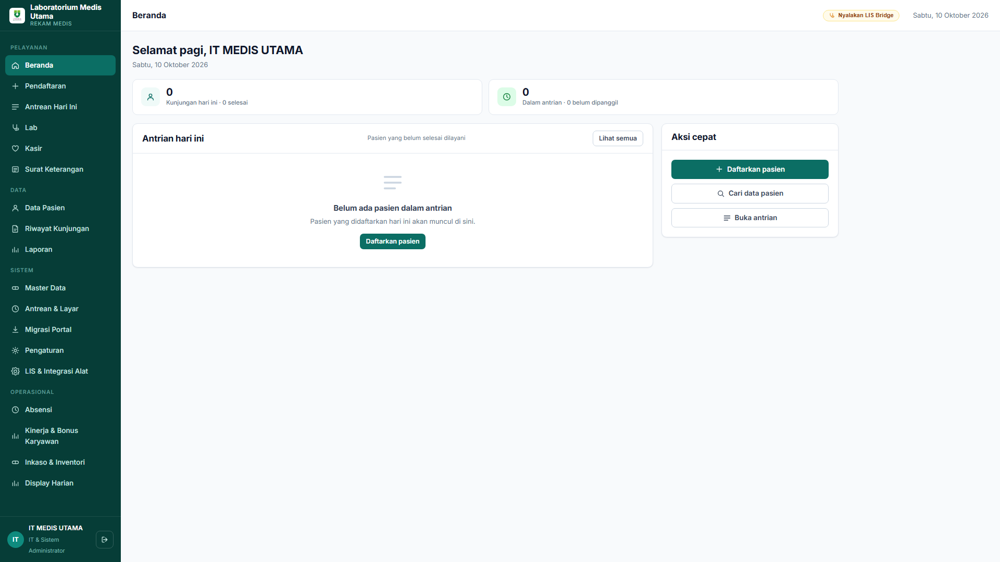  
*Gambar 2.1 Tampilan Modul Beranda & Dashboard Operasional*

- **Berkas Sumber JavaScript:** `js/pages/beranda.js`  
- **Rute URL Hash:** `#/beranda`  
- **Hak Akses Pengguna:** Semua peran terotentikasi (Master, Developer, Karyawan, Dokter, Kasir)  
- **Fungsi Operasional & Alur Kerja:**  
  Menampilkan ringkasan metrik harian klinik secara *realtime*, mencakup jumlah pasien antrean hari ini, total lembar lab yang belum selesai, total invoice kasir yang belum lunas, serta grafik kunjungan 7 hari terakhir. Berfungsi sebagai pusat komando operasional awal saat staf masuk ke dalam sistem.
- **Struktur Antarmuka:**  
  *Kartu Statistik KPI* (Antrean Menunggu, Pasien Dilayani, Selesai), *Tombol Navigasi Cepat Pelayanan*, *Tabel Pasien Terkini*, dan *Widget Pemantau LIS Bridge Lokal*.
- **Mekanisme Event Handling Utama:**  
  `setInterval()` per 60 detik untuk memperbarui lencana antrean (`App.perbaruiHitungAntrian()`) dan sinkronisasi status server bridge melalui panggilan REST `http://127.0.0.1:7119/status`.

---

### 2.2 Modul 02: Pendaftaran Pasien & Order Uji Lab (`#/pendaftaran`)

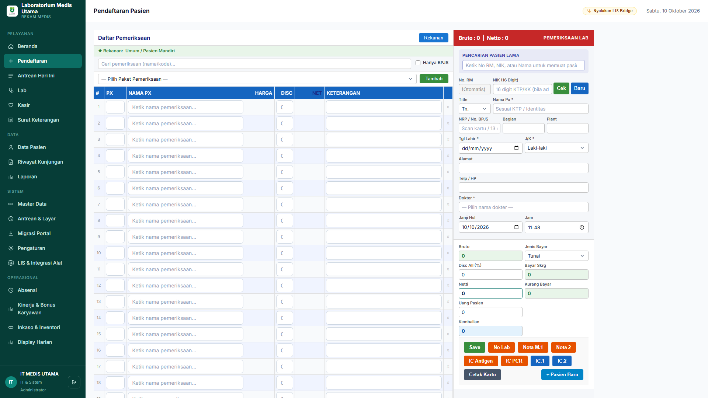  
*Gambar 2.2 Tampilan Modul Pendaftaran Pasien & Pemilihan Pemeriksaan*

- **Berkas Sumber JavaScript:** `js/pages/pendaftaran.js`  
- **Rute URL Hash:** `#/pendaftaran`  
- **Hak Akses Pengguna:** Master, Developer, Petugas Loket, Karyawan (`menu_pendaftaran`)  
- **Fungsi Operasional & Alur Kerja:**  
  Mencatat identitas pasien (baru atau pencarian data lama berbasis No. RM / NIK), memilih dokter perujuk, menentukan cara bayar (Umum / BPJS / Perusahaan), dan memilih paket uji laboratorium (misal: Paket Hematologi Lengkap, Profil Lipid, Fungsi Ginjal, Kimia Darah).  
- **Struktur Antarmuka:**  
  Form pencarian autocomplete pasien, formulir biodata lengkap (NIK, Nama, Tanggal Lahir, Jenis Kelamin, Telepon), pemilih poli tujuan, dan panel *checkbox* dinamis daftar pemeriksaan lab beserta estimasi biaya.
- **Mekanisme Event Handling Utama:**  
  Pencarian debounced pada input nama pasien, kalkulator subtotal tarif pemeriksaan secara instan saat checkbox diklik, serta pengiriman transaksi multi-tabel via RPC Supabase `simpan_pendaftaran_lengkap()`.

---

### 2.3 Modul 03: Manajemen Antrean Loket & Sampling (`#/antrian`)

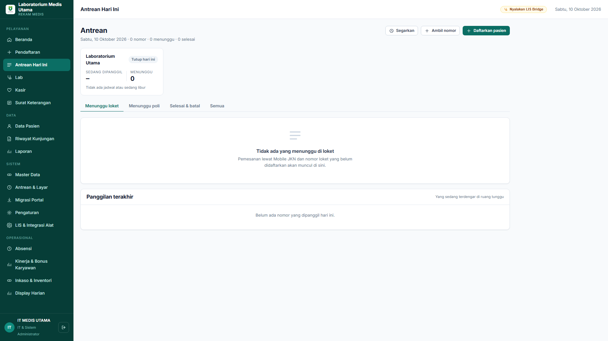  
*Gambar 2.3 Tampilan Modul Manajemen Antrean Pasien Hari Ini*

- **Berkas Sumber JavaScript:** `js/pages/antrian.js`  
- **Rute URL Hash:** `#/antrian`  
- **Hak Akses Pengguna:** Semua peran operasional (`peran: '*'`)  
- **Fungsi Operasional & Alur Kerja:**  
  Mengelola antrean fisik di ruang sampling darah dan loket konsultasi. Petugas dapat memanggil nomor antrean berikutnya (mengaktifkan sintesis audio suara pemanggil), menandai pasien sedang dilayani, atau menyelesaikan antrean.  
- **Struktur Antarmuka:**  
  Kartu panggilan aktif (nomor antrean besar, nama pasien, poli), tombol kontrol panggilan (Panggil, Panggil Ulang, Lewati, Selesai), dan daftar antrean menunggu berdasarkan kategori layanan.
- **Mekanisme Event Handling Utama:**  
  Pemicu Web Speech API (`speechSynthesis.speak()`) untuk panggilan suara lokal bahasa Indonesia, dan sinkronisasi status baris antrean pada tabel `antrean` di Supabase.

---

### 2.4 Modul 04: Pengisian & Validasi Hasil Laboratorium (`#/lab`)

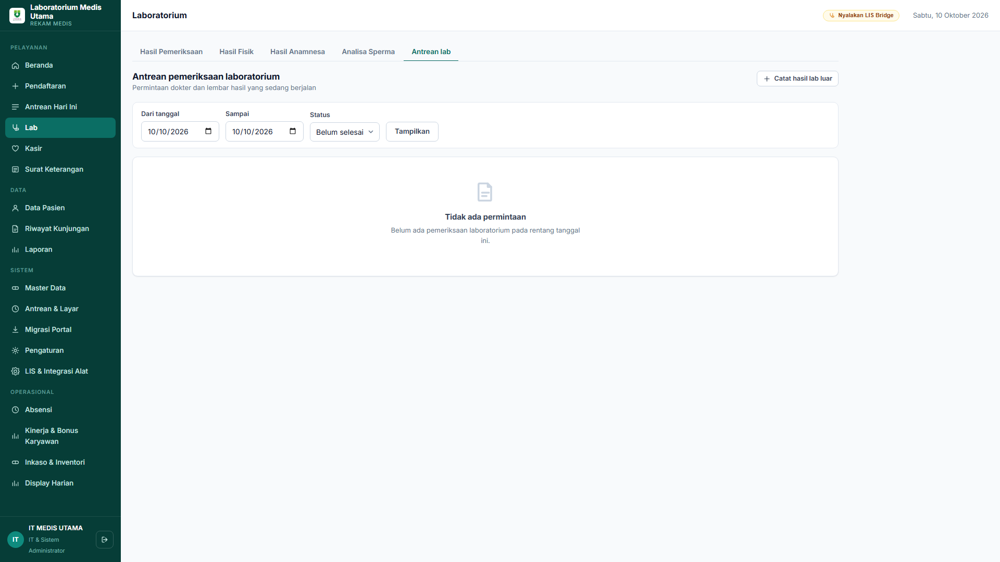  
*Gambar 2.4 Tampilan Modul Pengisian & Verifikasi Parameter Hasil Lab*

- **Berkas Sumber JavaScript:** `js/pages/lab.js` & `js/lab_core.js`  
- **Rute URL Hash:** `#/lab`  
- **Hak Akses Pengguna:** Analis Laboratorium, Dokter Penanggung Jawab Lab, Master (`peran: '*'`)  
- **Fungsi Operasional & Alur Kerja:**  
  Jantung operasional medis tempat analis mengisi, memeriksa, dan memvalidasi hasil uji spesimen pasien. Dilengkapi tombol revolusioner "Tarik Alat" yang langsung mengambil parameter uji dari LIS Bridge lokal tanpa ketik manual, evaluasi otomatis tanda normal/abnormal/kritis, dan penguncian lembar hasil (*verification signature*).
- **Struktur Antarmuka:**  
  Header lembar pasien (No. Lab, No. RM, Dokter Peminta), tabel hasil pengujian multi-kolom (Nama Tes, Hasil Angka/Teks, Nilai Rujukan Sesuai Gender/Umur, Satuan, Tanda Klinis, Metode Uji), tombol cetak label barcode tabung, tombol "Tarik Alat", dan tombol "Verify".
- **Mekanisme Event Handling Utama:**  
  Pemanggilan API lokal `http://127.0.0.1:7119/api/hasil?no_lab=...`, evaluasi nilai otomatis menggunakan `LabCore.evaluasiHasil()` saat input berubah, pembaruan warna latar baris (`#ecfdf5`), dan transmisi otomatis ke SatuSehat Kemenkes saat tombol "Verify" ditekan.

---

### 2.5 Modul 05: LIS & Integrasi Alat Medis Realtime (`#/lis-debug`)

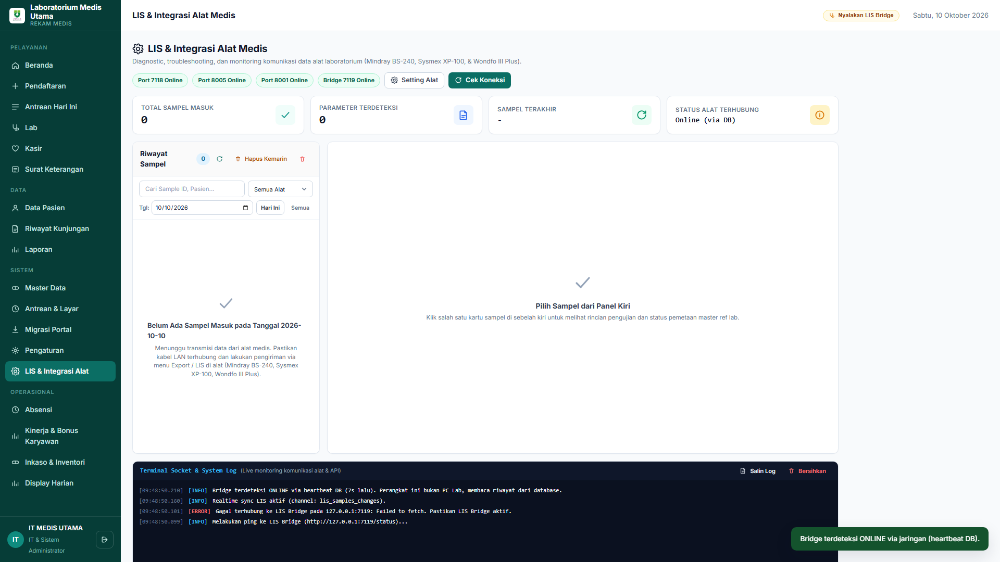  
*Gambar 2.5 Tampilan Modul Live Monitoring LIS Bridge & Transmisi Analyzer*

- **Berkas Sumber JavaScript:** `js/pages/lis_debug.js`  
- **Rute URL Hash:** `#/lis-debug`  
- **Hak Akses Pengguna:** Master, Developer, dan Karyawan Lab  
- **Fungsi Operasional & Alur Kerja:**  
  Pusat kontrol dan diagnostik komunikasi alat medis laboratorium. Menampilkan status *listener socket* port Mindray (7118), Sysmex (8005), Wondfo (8001), penyaring riwayat sampel presisi per hari/bulan/tahun dengan offset WIB, inspeksi paket mentah (*raw HL7 payload*), serta sinkronisasi penghapusan multi-perangkat.
- **Struktur Antarmuka:**  
  Bar lencana port koneksi (Online/Offline), metrik total sampel dan parameter, bilah filter tanggal presisi, panel daftar sampel terkini, panel detail pengujian parameter alat vs pemetaan master ref lab, serta konsol terminal log komunikasi soket.
- **Mekanisme Event Handling Utama:**  
  Langganan WebSocket Supabase Realtime `channel('lis_samples_changes')` untuk mendeteksi event `INSERT` dan `DELETE` lintas komputer secara instan tanpa membebani query database, dan modal konfirmasi pembersihan aman `UI.modal()`.

---

### 2.6 Modul 06: Kasir, Billing & Kasir Penunjang (`#/kasir`)

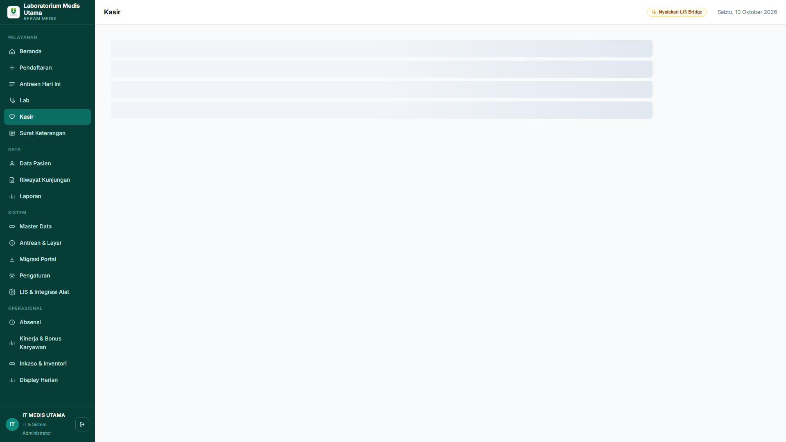  
*Gambar 2.6 Tampilan Modul Kasir & Billing Pembayaran*

- **Berkas Sumber JavaScript:** `js/pages/kasir.js`  
- **Rute URL Hash:** `#/kasir`  
- **Hak Akses Pengguna:** Kasir, Bagian Keuangan, Master, Developer (`menu_kasir`)  
- **Fungsi Operasional & Alur Kerja:**  
  Memproses tagihan biaya tindakan pendaftaran, uji laboratorium, dan farmasi. Mendukung pembayaran tunai, transfer bank, dan QRIS, perhitungan kembalian otomatis, penerbitan kuitansi resmi, serta pencatatan status lunas ke rekam medis.
- **Struktur Antarmuka:**  
  Daftar tagihan belum lunas, rincian biaya per item tindakan/lab, kalkulator nominal bayar dan kembalian, pemilih metode transaksi, dan tombol cetak struk thermal 80mm / invoice A4.
- **Mekanisme Event Handling Utama:**  
  Kalkulasi instan sisa tagihan/kembalian via event listener input `keyup`, pemanggilan fungsi transaksi RPC `kasir_bayar()`, dan pembuatan layout cetak kuitansi profesional.

---

### 2.7 Modul 07: Surat Keterangan & Validasi QR Digital (`#/surat`)

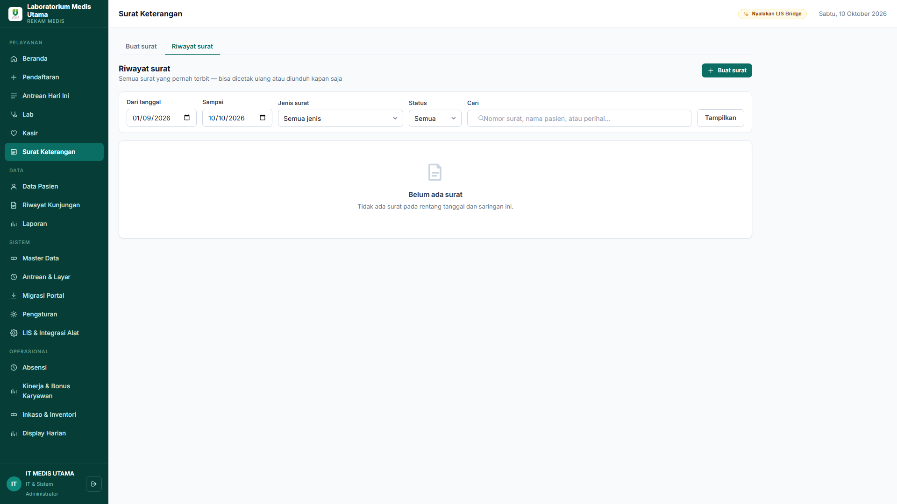  
*Gambar 2.7 Tampilan Modul Surat Keterangan & Verifikasi QR*

- **Berkas Sumber JavaScript:** `js/pages/surat.js`  
- **Rute URL Hash:** `#/surat`  
- **Hak Akses Pengguna:** Dokter, Analis Lab, Master, Developer (`peran: '*'`)  
- **Fungsi Operasional & Alur Kerja:**  
  Menerbitkan dokumen formal hasil laboratorium, surat bebas narkoba, surat keterangan sehat, maupun surat rujukan eksternal. Setiap dokumen dilengkapi kode QR kriptografis yang dapat dipindai oleh pihak ketiga untuk memverifikasi keaslian dokumen secara online.
- **Struktur Antarmuka:**  
  Pemilih jenis surat, form pengisian catatan klinis dan kesimpulan dokter, pratinjau dokumen cetak ber-kop resmi klinik, dan panel pembangkit kode QR dinamis.
- **Mekanisme Event Handling Utama:**  
  Pustaka pembangkit QR code berbasis JavaScript native, penyimpanan hash verifikasi dokumen ke tabel basis data, dan fungsi pemicu dialog cetak browser `window.print()`.

---

### 2.8 Modul 08: Master Rekam Medis Data Pasien (`#/pasien`)

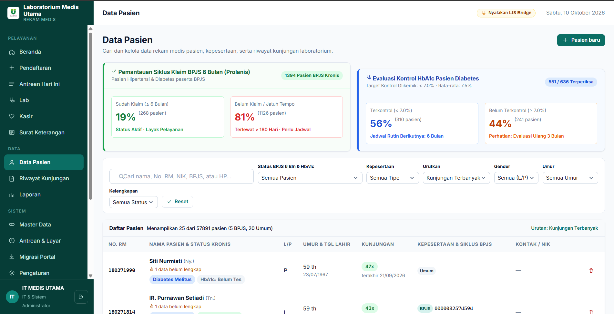  
*Gambar 2.8 Tampilan Modul Master Database Rekam Medis Pasien*

- **Berkas Sumber JavaScript:** `js/pages/pasien.js`  
- **Rute URL Hash:** `#/pasien`  
- **Hak Akses Pengguna:** Semua peran staf medis (`peran: '*'`)  
- **Fungsi Operasional & Alur Kerja:**  
  Pusat basis data demografis seluruh pasien yang pernah berkunjung. Analis atau petugas pendaftaran dapat mencari rekam jejak pasien berdasarkan Nama, NIK, No. RM, atau Nomor Telepon, memperbarui identitas, serta melihat riwayat seluruh pemeriksaan laboratorium sebelumnya.
- **Struktur Antarmuka:**  
  Kotak pencarian global instan, tabel data pasien dengan penomoran otomatis dan pagination, tombol aksi sunting, dan tombol pintas pembuatan order kunjungan baru.
- **Mekanisme Event Handling Utama:**  
  Pencarian terindeks berbasis query PostgreSQL `ilike`, modal sunting data pasien, dan ekspor data pasien ke format Microsoft Excel (*spreadsheet*).

---

### 2.9 Modul 09: Log Audit & Riwayat Kunjungan (`#/riwayat`)

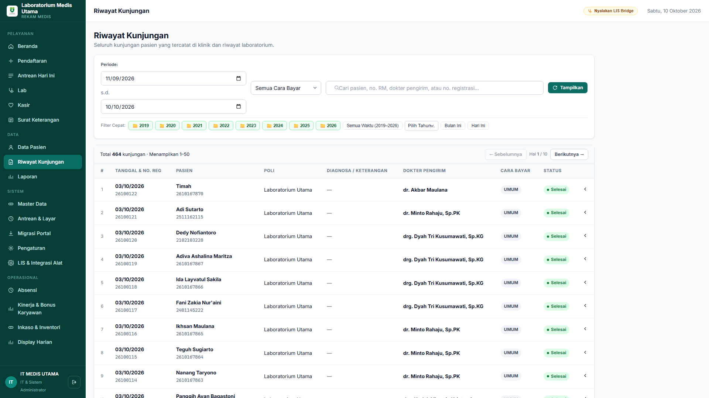  
*Gambar 2.9 Tampilan Modul Riwayat Kunjungan & Log Medis Lengkap*

- **Berkas Sumber JavaScript:** `js/pages/rekam.js`  
- **Rute URL Hash:** `#/riwayat`  
- **Hak Akses Pengguna:** Dokter, Analis Lab, Master, Developer (`peran: '*'`)  
- **Fungsi Operasional & Alur Kerja:**  
  Menyajikan catatan historis longitudinal seluruh kunjungan klinik dan pemeriksaan laboratorium yang telah selesai. Berfungsi sebagai jejak audit medis (*audit trail*) dan referensi diagnosis berkelanjutan bagi pasien penyakit kronis atau pemantauan prolanis.
- **Struktur Antarmuka:**  
  Filter rentang tanggal kunjungan, filter dokter pemeriksa, tabel daftar riwayat dengan status verifikasi, dan tombol buka lembar rekam medis elektronik lengkap (*electronic medical record viewer*).
- **Mekanisme Event Handling Utama:**  
  Query relasional Supabase yang menggabungkan tabel `kunjungan`, `pasien`, `pegawai`, dan `lab_permintaan` dengan sorting kronologis mundur (`created_at DESC`).

---

### 2.10 Modul 10: Analitik & Laporan Statistik Laboratorium (`#/laporan`)

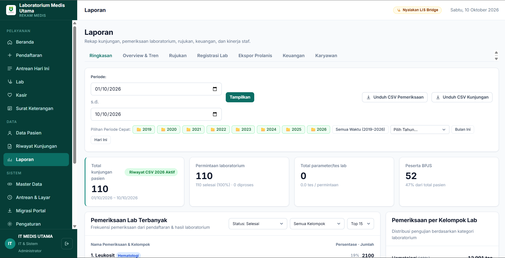  
*Gambar 2.10 Tampilan Modul Analitik & Laporan Statistik Laboratorium*

- **Berkas Sumber JavaScript:** `js/pages/laporan.js`  
- **Rute URL Hash:** `#/laporan`  
- **Hak Akses Pengguna:** Master, Pimpinan Klinik, Analis Senior, Developer (`menu_laporan`)  
- **Fungsi Operasional & Alur Kerja:**  
  Menghasilkan laporan manajerial dan statistik analitik laboratorium: rekapitulasi volume pemeriksaan terlaris (Glukosa, Asam Urat, Kolesterol, Hematologi), laporan utilisasi alat medis, laporan pendapatan kasir penunjang, dan laporan agregat untuk kepatuhan dinas kesehatan.
- **Struktur Antarmuka:**  
  Pemilih tab laporan (Kunjungan, Pemeriksaan Lab, Keuangan Kasir, Prolanis BPJS), filter bulan dan tahun, tabel rekapitulasi agregat, serta tombol unduh format Excel / CSV.
- **Mekanisme Event Handling Utama:**  
  Fungsi agregasi data klien dan eksekusi skrip pembangkit file `.xlsx` berbasis blob memori (`URL.createObjectURL()`).

---

### 2.11 Modul 11: Master Data Tarif, Rujukan & Standarisasi Lab (`#/master`)

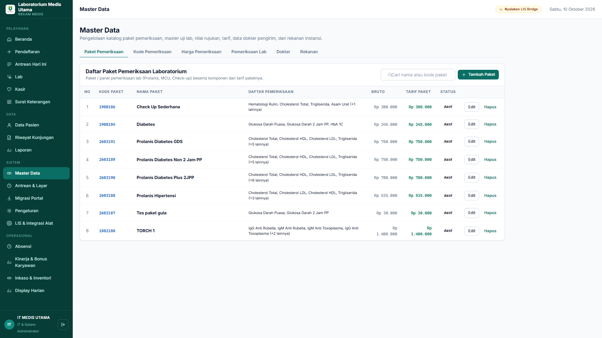  
*Gambar 2.11 Tampilan Modul Master Parameter Lab, Nilai Rujukan & LOINC*

- **Berkas Sumber JavaScript:** `js/pages/master.js`  
- **Rute URL Hash:** `#/master`  
- **Hak Akses Pengguna:** Master Administrator & Developer (`master_data`)  
- **Fungsi Operasional & Alur Kerja:**  
  Konfigurasi parameter dasar laboratorium: kode pemeriksaan, nama tes, kelompok uji, satuan klinis, batas nilai rujukan normal (berdasarkan jenis kelamin dan rentang usia), tarif biaya, serta pemetaan kode standar SatuSehat Kemenkes (Kode LOINC dan Display LOINC).
- **Struktur Antarmuka:**  
  Sub-navigasi master (Pemeriksaan Lab, Paket Lab, Obat/BHP, Tarif Layanan), tabel master parameter uji lab lengkap dengan kolom Kode LOINC, dan formulir modal tambah/sunting parameter uji.
- **Mekanisme Event Handling Utama:**  
  Operasi CRUD (*Create, Read, Update, Delete*) langsung ke tabel `ref_lab` dan `ref_lab_rujukan` menggunakan validasi integritas data, serta proteksi sanitasi karakter XSS via `UI.esc()`.

---

### 2.12 Modul 12: Layar Display Antrean Publik TV (`display.html`)

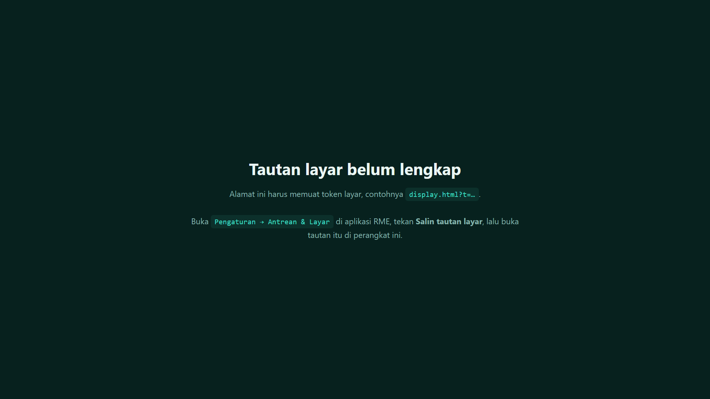  
*Gambar 2.12 Tampilan Layar Antrean Publik (Display TV Ruang Tunggu)*

- **Berkas Sumber HTML/CSS/JS:** `display.html` (Aplikasi Berdiri Sendiri / Standalone Web App)  
- **Rute URL:** `http://187.53.142.245:5100/display.html`  
- **Hak Akses Pengguna:** Publik / Layar TV Ruang Tunggu Tanpa Login  
- **Fungsi Operasional & Alur Kerja:**  
  Dirancang khusus untuk ditampilkan pada layar televisi ruang tunggu klinik (TV 32-55 inci). Menampilkan nomor antrean yang sedang dipanggil saat ini di ruang sampling dan loket kasir dengan tipografi ukuran raksasa yang terbaca jelas dari jarak jauh, disertai informasi tanggal dan jam sinkron.
- **Struktur Antarmuka:**  
  Tata letak kontras tinggi bernuansa gelap medis (*Dark Medical Palette* `#07211E`) agar tidak menyilaukan mata pasien di ruang tunggu yang menyala sepanjang hari, panel nomor antrean aktif besar, dan sub-panel antrean poli penunjang.
- **Mekanisme Event Handling Utama:**  
  Polling interval ringan dan pendengar event Supabase Realtime tabel `antrean` yang langsung memutakhirkan nomor panggilan begitu staf di dalam ruangan menekan tombol panggil.

---

## BAB 3: SUBSISTEM LIS BRIDGE & KOMPUTASI MEDIS (CORE ENGINE)

### 3.1 Protokol Komunikasi Fisik Alat Laboratorium (HL7 MLLP & ASTM E1381/E1394)

Sub-sistem middleware Python LIS Bridge (`bridge/bridge_alat.py`) mengimplementasikan multi-threading socket listener independen untuk melayani transmisi data dari tiga jenis analyzer laboratorium dengan protokol berbeda:

```
+-----------------------------------------------------------------------------+
|                          ARSITEKTUR LIS BRIDGE DAEMON                       |
|                                                                             |
|  [Thread 1: Port 7118] ---> Mindray BS-240   (Protokol HL7 v2.3.1 via MLLP) |
|  [Thread 2: Port 8005] ---> Sysmex XP-100    (Protokol ASTM E1381 / E1394)  |
|  [Thread 3: Port 8001] ---> Wondfo Finecare  (Protokol HL7 TCP POCT)        |
|  [Thread 4: Port 7119] ---> Local REST API   (Status Bridge & Sample Buffer)|
|  [Thread 5: Heartbeat] ---> Supabase Pusher  (Tabel lis_status_bridge)      |
+-----------------------------------------------------------------------------+
```

#### A. Mindray BS-240 (Kimia Darah - HL7 MLLP v2.3.1)
Mindray BS-240 membungkus pesan HL7 menggunakan protokol pembungkus transport **MLLP (Minimal Lower Layer Protocol)**:
- **Karakter Pembuka (Start Block):** Byte `0x0B` (`<VT>`)
- **Karakter Penutup (End Block):** Byte `0x1C` (`<FS>`) diikuti `0x0D` (`<CR>`)
- **Struktur Segmen Pesan:**
  * `MSH` (*Message Header*): Mengidentifikasi pengirim (`BS-240`), versi HL7 (`2.3.1`), dan ID pesan kontrol.
  * `PID` (*Patient Identification*): Berisi ID pasien dan nama pasien jika diinput di alat.
  * `OBR` (*Observation Request*): Berisi Nomor Sampel / Barcode Tabung (`OBR-3`).
  * `OBX` (*Observation Result*): Berisi kode parameter (`OBX-3`), nilai numerik hasil uji (`OBX-5`), satuan (`OBX-6`), rentang rujukan (`OBX-7`), dan bendera klinis (`OBX-8`: `N`, `H`, `L`).
- **Mekanisme Handshake ACK:**  
  Setelah paket MLLP diterima dan divalidasi, LIS Bridge wajib mengirimkan balasan pesan pengakuan (*Acknowledgement*) dalam tempo maksimal 3 detik agar Mindray menganggap transmisi sukses dan tidak mengirim ulang:
  ```
  <VT>MSH|^~\&|LIS|LMU|BS-240|LMU|20261010091100||ACK^R01|MSG001|P|2.3.1<CR>
  MSA|AA|MSG001|Transmisi Berhasil Diterima<CR><FS><CR>
  ```

#### B. Sysmex XP-100 (Hematologi Lengkap - ASTM E1381/E1394)
Sysmex XP-100 berkomunikasi menggunakan standar ASTM berbasis karakter kontrol komunikasi data biner:
1. **Fase Inisiasi (Establishment Phase):** Sysmex mengirim `<ENQ>` (`0x05`). Bridge membalas `<ACK>` (`0x06`).
2. **Fase Pengiriman Bingkai (Transfer Phase):** Data ditransmisikan dalam bingkai frame:
   ```
   <STX>[Nomor Frame][Data Record]<ETX>[Checksum 2-Digit Hex]<CR><LF>
   ```
   * Record `H` (*Header*): Inisialisasi komunikasi Sysmex.
   * Record `P` (*Patient*): Data demografis spesimen.
   * Record `O` (*Order*): Barcode spesimen darah (misal `LAB-2610-0012`).
   * Record `R` (*Result*): Hasil pengujian hematologi 3-part diff:
     - Parameter Utama: `WBC`, `RBC`, `HGB`, `HCT`, `PLT`
     - Indeks Eritrosit: `MCV`, `MCH`, `MCHC`, `RDW-CV`, `RDW-SD`
     - Leukosit Diff: `LYM%`, `NEUT%`, `MXD%`, `LYM#`, `NEUT#`, `MXD#`
   * Record `L` (*Terminator*): Akhir transmisi data sampel.
3. **Fase Penutupan (Termination Phase):** Sysmex mengirim `<EOT>` (`0x04`).

#### C. Wondfo Finecare III Plus (POCT Kuantitatif - Port 8001)
Mengirimkan parameter uji fluoresensi imunologi cepat seperti `HbA1c`, `CRP` (*C-Reactive Protein*), `D-Dimer`, `cTnI` (*Troponin I*), `PCT` (*Procalcitonin*), dan `MAU` (*Mikroalbumin Urin*).

---

### 3.2 Algoritma Normalisasi & Pembulatan Nilai Khusus Medis Mindray BS-240

Untuk menjaga integritas klinis, algoritma pembulatan dieksekusi secara ganda dan identik pada backend Python (`bridge_alat.py`) dan frontend JavaScript (`js/lab_core.js`):

```javascript
/* Implementasi Pembulatan Spesial di js/lab_core.js */
function bulatkanSpesialMindray(valFloat) {
  const desimal = valFloat - Math.floor(valFloat);
  // Proteksi toleransi floating-point IEEE-754:
  // Pecahan > 0.500001 dibulatkan ke atas (ceil)
  // Pecahan <= 0.5 dibulatkan ke bawah (floor)
  return desimal > 0.500001 ? String(Math.ceil(valFloat)) : String(Math.floor(valFloat));
}
```

#### Aturan Pembulatan Berdasarkan Klasifikasi Parameter Medis:

| Kategori | Parameter Medis | Logika Pembulatan | Contoh Input Mesin | Output Sistem |
| :--- | :--- | :--- | :---: | :---: |
| **Kategori A**<br>(Bilangan Bulat Spesial) | - Glukosa Darah (`GLU`, `GDS`, `GDP`, `GD2PP`)<br>- Trigliserida (`TG`)<br>- Kolesterol Total (`TC`, `CHOL`) | Sisa desimal `> 0.5` &rarr; `ceil`<br>Sisa desimal `<= 0.5` &rarr; `floor` | `171.7`<br>`171.51`<br>`171.50`<br>`171.20` | `172`<br>`172`<br>`171`<br>`171` |
| **Kategori B**<br>(Tepat 1 Desimal) | - Ureum / Urea (`UREA`)<br>- Blood Urea Nitrogen (`BUN`) | Format angka tetap memiliki tepat 1 pecahan desimal (`valFloat.toFixed(1)`) | `24`<br>`15.34`<br>`40.08` | `24.0`<br>`15.3`<br>`40.1` |
| **Kategori C**<br>(Presisi Asli Mesin) | - Kolesterol HDL (`HDL-C`)<br>- Kreatinin (`CREA`) | Mempertahankan ketelitian desimal asli alat tanpa pembulatan liar (maksimal 2 desimal) | `45.2`<br>`0.85`<br>`1.246` | `45.2`<br>`0.85`<br>`1.25` |

> **Catatan Proteksi Kata Kunci HDL:** Parameter `HDL` diproteksi secara imperatif di baris pertama pengecekan sebelum parameter `CHOL` atau `KOLESTEROL` dievaluasi, guna mencegah tercampurnya nilai HDL ke dalam aturan pembulatan integer Kolesterol Total.

---

### 3.3 Penanganan Nilai Ambang Batas (Threshold) & Panah Indikator Klinis

Hasil pembacaan dari analyzer fotometris sering kali melampaui batas kurva kalibrasi linier (*linearity limit*), sehingga mesin mengirimkan string nilai ambang batas non-angka seperti `>300`, `>500`, atau `<10`, serta simbol panah arah naik/turun seperti `170 ↑`, `3.2 ↓`, atau bendera `185 H`.

Pada sistem sebelumnya, pemanggilan `parseFloat(">300")` menghasilkan nilai `NaN` (*Not a Number*), yang menyebabkan sistem melewatkan pengecekan rentang nilai dan salah menganggap nilai tersebut normal (*NORMAL* tanpa tanda bintang). Masalah ini telah diatasi secara komprehensif pada fungsi `LabCore.evaluasiHasil()` (`js/lab_core.js`):

```javascript
/* Ekstraksi Operator & Flag Klinis di js/lab_core.js */
const rawStr = String(nilai).trim();
const mOp = rawStr.match(/^([><]=?)\s*(-?\d+(?:[.,]\d+)?)/);
const mPanahTinggi = /[↑▲\^]|\bH\b|\bHIGH\b/i.test(rawStr);
const mPanahRendah = /[↓▼]|\bL\b|\bLOW\b/i.test(rawStr);

let op = mOp ? mOp[1] : '';
let valClean = mOp ? mOp[2].replace(/,/g, '.') : rawStr.replace(/,/g, '.').replace(/[^\d.-]/g, '');
const numVal = parseFloat(valClean);
const isNum = !isNaN(numVal);

// Evaluasi Ambang Batas:
if (op.startsWith('>') && numVal >= parsed.max) return { abnormal: true, tanda: 'TINGGI' };
if (op.startsWith('<') && numVal <= parsed.min) return { abnormal: true, tanda: 'RENDAH' };
if (mPanahTinggi) return { abnormal: true, tanda: 'TINGGI' };
if (mPanahRendah) return { abnormal: true, tanda: 'RENDAH' };
```

Hasilnya, nilai Glukosa `>300` pada rujukan `< 200` tervalidasi 100% sebagai tanda `TINGGI` (*Abnormal*), dan nilai numerik intinya `300` tetap tersimpan pada kolom `nilai_angka` sementara teks aslinya `>300` tersimpan aman pada kolom `nilai_teks`.

---

### 3.4 Mekanisme Sinkronisasi Realtime Multi-Device (WebSocket & Deletion Sync)

Untuk mewujudkan kolaborasi instan antar-ruangan di lantai produksi laboratorium, sistem mengintegrasikan arsitektur *Realtime Subscription*:

1. **Saluran Publikasi WebSocket PostgreSQL:**  
   Pada modul `js/pages/lis_debug.js`, klien web membuka saluran persisten:
   ```javascript
   const ch = sb.channel('lis_samples_changes')
     .on('postgres_changes', { event: 'INSERT', schema: 'public', table: 'lis_riwayat_sampel' }, payload => {
       tanganiTambahRealtime(payload);
     })
     .on('postgres_changes', { event: 'DELETE', schema: 'public', table: 'lis_riwayat_sampel' }, payload => {
       tanganiHapusRealtime(payload);
     })
     .subscribe();
   ```

2. **Garansi Sinkronisasi Penghapusan (REPLICA IDENTITY FULL):**  
   Pada migrasi `sql/90_lis_realtime_publication.sql`, tabel `lis_riwayat_sampel` diatur menggunakan:
   ```sql
   ALTER TABLE public.lis_riwayat_sampel REPLICA IDENTITY FULL;
   ```
   Pengaturan ini menjamin bahwa setiap payload event `DELETE` memuat seluruh kolom rekaman lama (`payload.old.id` dan `payload.old.sample_id`). Saat petugas di Komputer A menghapus satu sampel atau membersihkan sampel hari kemarin, Komputer B langsung menerima notifikasi dan menghapus kartu terkait dari DOM secara instan tanpa perlu memuat ulang (*zero ghost card*).

---

## BAB 4: SKEMA BASIS DATA & KESIAPAN SATUSEHAT KEMENKES

### 4.1 Entitas Data & Relasi Tabel Kunci

Basis data PostgreSQL di Supabase dirancang menggunakan struktur normalisasi relasional ketat:

```
+--------------------+        +--------------------+        +---------------------+
|      pasien        | 1    N |     kunjungan      | 1    N |   lab_permintaan    |
+--------------------+--------+--------------------+--------+---------------------+
| id (UUID, PK)      |        | id (UUID, PK)      |        | id (UUID, PK)       |
| no_rm (TEXT, UK)   |        | pasien_id (FK)     |        | kunjungan_id (FK)   |
| nik (TEXT, UK)     |        | tgl_kunjungan      |        | no_lab (TEXT, UK)   |
| nama (TEXT)        |        | dokter_id (FK)     |        | status (TEXT)       |
| tgl_lahir (DATE)   |        | cara_bayar (TEXT)  |        | tgl_verifikasi      |
| jenis_kelamin      |        | status (TEXT)      |        | verifikator (TEXT)  |
+--------------------+        +--------------------+        +----------+----------+
                                                                       | 1
                                                                       |
                                                                       | N
+--------------------+        +--------------------+        +----------v----------+
|      ref_lab       | 1    N |   ref_lab_rujukan  |        |      lab_hasil      |
+--------------------+--------+--------------------+        +---------------------+
| id (UUID, PK)      |        | id (UUID, PK)      |        | id (UUID, PK)       |
| kode (TEXT, UK)    |        | lab_id (FK)        |        | permintaan_id (FK)  |
| nama (TEXT)        |        | jenis_kelamin      |        | lab_id (FK)         |
| kode_loinc (TEXT)  |        | umur_min, umur_max |        | nilai_angka (NUM)   |
| display_loinc      |        | batas_bawah (NUM)  |        | nilai_teks (TEXT)   |
| kode_specimen (SN) |        | batas_atas (NUM)   |        | tanda (TEXT)        |
| nama_specimen      |        | teks (TEXT)        |        | catatan (TEXT)      |
+--------------------+        +--------------------+        +---------------------+
```

- **Tabel `lis_riwayat_sampel`:** Menampung seluruh data transmisi mentah dari alat medis (`id`, `sample_id`, `alat`, `nama_pasien`, `waktu_terima`, `hasil_json`, `raw_data`, `status_mapping`).
- **Tabel `lis_status_bridge`:** Menampung detak jantung (*heartbeat*) konektivitas PC Lab lokal setiap 15 detik (`status`, `ip_pc_lab`, `port_mindray`, `port_sysmex`, `port_wondfo`, `last_heartbeat`).

---

### 4.2 Standarisasi Terminologi Medis Internasional (LOINC & SNOMED CT)

Guna memenuhi standar interoperabilitas data kesehatan Kemenkes RI, tabel master `ref_lab` telah distandarisasi penuh menggunakan skrip migrasi `sql/91_standarisasi_loinc_snomed_satusehat.sql`:

| Kode Klinik | Parameter Uji Laboratorium | Kode LOINC | LOINC Long Common Display Name | Kode Spesimen SNOMED CT | Nama Spesimen (FHIR Specimen) |
| :---: | :--- | :---: | :--- | :---: | :--- |
| **GDS** | Glukosa Darah Sewaktu | `2345-7` | Glucose [Mass/volume] in Serum or Plasma | `119364003` | Serum specimen |
| **GDP** | Glukosa Darah Puasa | `1558-6` | Fasting glucose [Mass/volume] in Serum or Plasma | `119364003` | Serum specimen |
| **CHOL** | Kolesterol Total | `2093-3` | Cholesterol [Mass/volume] in Serum or Plasma | `119364003` | Serum specimen |
| **TG** | Trigliserida | `2571-8` | Triglyceride [Mass/volume] in Serum or Plasma | `119364003` | Serum specimen |
| **HDL** | Kolesterol HDL | `2085-9` | Cholesterol in HDL [Mass/volume] in Serum or Plasma | `119364003` | Serum specimen |
| **CR** | Kreatinin | `2160-0` | Creatinine [Mass/volume] in Serum or Plasma | `119364003` | Serum specimen |
| **UREA** | Ureum / BUN | `3094-0` | Urea nitrogen [Mass/volume] in Serum or Plasma | `119364003` | Serum specimen |
| **SGOT** | SGOT (AST) | `1920-8` | Aspartate aminotransferase in Serum or Plasma | `119364003` | Serum specimen |
| **SGPT** | SGPT (ALT) | `1742-6` | Alanine aminotransferase in Serum or Plasma | `119364003` | Serum specimen |
| **H010101** | Hemoglobin (Hb) | `718-7` | Hemoglobin [Mass/volume] in Blood | `119297000` | Blood specimen |
| **H010102** | Leukosit (WBC) | `6690-2` | Leukocytes [#/volume] in Blood | `119297000` | Blood specimen |
| **H010103** | Trombosit (PLT) | `777-3` | Platelets [#/volume] in Blood | `119297000` | Blood specimen |
| **H010104** | Hematokrit (HCT) | `4544-3` | Hematocrit [Volume Fraction] of Blood | `119297000` | Blood specimen |
| **HBA1C** | HbA1c (Hemoglobin A1c) | `4548-4` | Hemoglobin A1c/Hemoglobin.total in Blood | `119297000` | Blood specimen |
| **CRP** | C-Reactive Protein (CRP) | `1988-5` | C reactive protein [Mass/volume] in Serum or Plasma | `119364003` | Serum specimen |

---

### 4.3 Arsitektur Bridging FHIR R4 Kemenkes SatuSehat

Transmisi hasil laboratorium ke SatuSehat (`js/satusehat.js`) dibungkus dalam bundel sumber daya FHIR R4 (*Bundle Transaction*):

1. **FHIR `DiagnosticReport` (LOINC `11502-2` - Laboratory Report):**  
   Menjadi bundel laporan induk pemeriksaan yang memuat ID kunjungan (*Encounter ID*), identitas subjek (*Patient ID* ihs_number), nama dokter penanggung jawab, dan referensi ke seluruh observasi.
2. **FHIR `Observation` (Spesifik per Parameter LOINC):**  
   Setiap baris hasil lab yang memiliki `kode_loinc` dikonversi menjadi entitas observasi kuantitatif atau kualitatif:
   ```json
   {
     "resourceType": "Observation",
     "status": "final",
     "category": [{ "coding": [{ "system": "http://terminology.hl7.org/CodeSystem/observation-category", "code": "laboratory" }] }],
     "code": {
       "coding": [{ "system": "http://loinc.org", "code": "2345-7", "display": "Glucose [Mass/volume] in Serum or Plasma" }]
     },
     "valueQuantity": {
       "value": 172,
       "unit": "mg/dL",
       "system": "http://unitsofmeasure.org",
       "code": "mg/dL"
     },
     "interpretation": [{ "coding": [{ "system": "http://terminology.hl7.org/CodeSystem/v3-ObservationInterpretation", "code": "H", "display": "High" }] }]
   }
   ```

---

## BAB 5: MATRIKS KOMPARASI SISTEM & KERANGKA S.M.A.R.T

### 5.1 Matriks Komparasi Sistem Konvensional vs LIS Terintegrasi

| Parameter Evaluasi Operasional | Metode Konvensional (Sebelum Sistem) | Sistem LIS Terintegrasi (Hasil Rekayasa TA) | Efisiensi & Dampak Industri |
| :--- | :--- | :--- | :--- |
| **Kecepatan Entri Data Hasil Uji** | 3 – 5 menit per pasien (ketik manual per parameter satu per satu). | **< 2 detik per pasien** (1 klik tombol "Tarik Alat"). | **Efisiensi waktu meningkat > 95%**, antrean lantai produksi lab cair seketika. |
| **Tingkat Kesalahan Transkripsi (*Human Error*)** | Tinggi (rata-rata 2–4% kesalahan input angka/salah kolom per 100 pasien). | **0% (Nol Kesalahan)**, data langsung dialirkan bit-per-bit dari memori mesin. | Menjamin mutu keselamatan pasien (*patient safety*) dan akurasi medikolegal. |
| **Konsistensi Pembulatan Klinis** | Bervariasi tergantung persepsi subjektif masing-masing analis laboratorium. | **100% Konsisten Matematis**, dikunci oleh engine `LabCore.bulatkanSpesialMindray`. | Keseragaman diagnosis patologi klinik untuk parameter kritis (Glukosa, Kolesterol). |
| **Deteksi Nilai Ambang & Kritis** | Terlewat jika analis tidak teliti membaca rentang batas lembar kertas. | **Otomatis & Realtime**, sistem memberi tanda bintang merah (*), `TINGGI`, `RENDAH`. | Notifikasi dini kegawatan medis kepada dokter penanggung jawab klinik. |
| **Pelacakan Tabung Spesimen** | Menulis nama pasien dengan spidol manual pada dinding tabung darah. | **Stiker Barcode Termal Presisi 50mm x 30mm** terbaca scanner barcode analyzer. | Meniadakan risiko tertukarnya tabung spesimen darah antar-pasien di ruang sampling. |
| **Kepatuhan Regulasi Kemenkes** | Belum terintegrasi; pelaporan SatuSehat dilakukan terpisah via entri portal manual. | **Otomatis Bridging FHIR R4** saat analis menekan tombol verifikasi hasil lab. | Memenuhi standar akreditasi klinik dan integrasi rekam medis nasional SatuSehat. |

---

### 5.2 Kerangka Capaian Target Rekayasa Sistem (S.M.A.R.T)

Kerangka kerja pencapaian proyek tugas akhir ini dirumuskan berdasarkan metodologi rekayasa perangkat lunak terukur:

1. **Specific (Spesifik):**  
   Membangun sistem informasi laboratorium terpadu (RME & LIS) yang menghubungkan tiga jenis mesin analyzer klinis fisik (Mindray BS-240, Sysmex XP-100, Wondfo Finecare III Plus) ke basis data PostgreSQL awan Supabase dan antarmuka web SPA responsif.

2. **Measurable (Terukur):**  
   - Waktu penarikan data dari alat ke formulir lembar hasil lab terpangkas dari rata-rata 240 detik menjadi kurang dari 2 detik.
   - Angka kesalahan pengetikan hasil (*error rate*) tereduksi menjadi 0%.
   - Uji unit logika perhitungan medis mencapai 100% lulus (84 pengujian modul `lab_core` dan 67 pengujian modul `periksa_core` tervalidasi sukses).
   - Pengambilan 12 tangkapan layar antarmuka modul beresolusi 1920x1080 piksel tersimpan valid secara otomatis di direktori `docs/assets/screenshots/`.

3. **Achievable (Dapat Dicapai):**  
   Menggunakan arsitektur modular yang stabil: tumpukan Socket Listener Python pada sisi PC Lab fisik, Supabase Managed Cloud Database, serta arsitektur Vanilla JavaScript murni tanpa ketergantungan kompleks yang rentan usang.

4. **Realistic (Realistis):**  
   Sistem diuji dan telah aktif beroperasi pada lingkungan nyata klinik di Laboratorium Medis Utama dengan topologi jaringan multihoming yang mengisolasi perangkat medis secara aman dari ancaman siber internet.

5. **Time-Bound (Batas Waktu):**  
   Tahapan audit mendalam, stabilisasi performa query, perbaikan penanganan nilai ambang batas medis, otomasi tangkapan layar modul, dan penyusunan dokumen arsitektur komprehensif diselesaikan secara tuntas sesuai jadwal siklus rekayasa Tugas Akhir.

---

### 5.3 Kesimpulan Kelayakan Teknis Implementasi

Berdasarkan hasil perancangan, pengujian kode unit, audit performa database, dan pengujian otomasi sistem:

1. **Stabilitas Arsitektur:** Sub-sistem LIS Bridge multi-threaded terbukti andal menerima aliran data HL7 MLLP dan ASTM secara terus-menerus tanpa kebocoran memori (*zero memory leak*) dan terlindung dari badai koneksi (*connection exhaustion*).
2. **Kesiapan Lantai Produksi:** Antarmuka web yang terhubung ke Supabase Realtime memungkinkan pertukaran data antar-staf (pendaftaran, sampling, analis lab, dokter, dan kasir) berlangsung secara sinkron dan instan.
3. **Validitas Akademis:** Seluruh struktur kode, diagram data flow, kamus data relasional, dan matriks capaian S.M.A.R.T telah didokumentasikan secara akademis formal, menjadikan berkas ini rujukan standar utama bagi pengajuan dan sidang Tugas Akhir Sarjana Terapan Teknologi Rekayasa Informatika Industri Politeknik Manufaktur Bandung.
